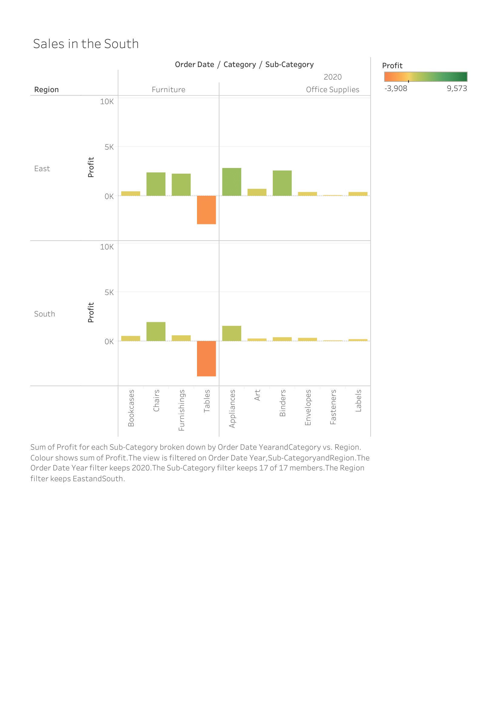
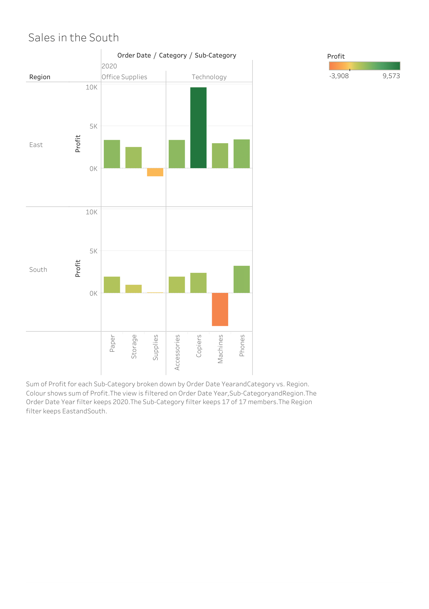
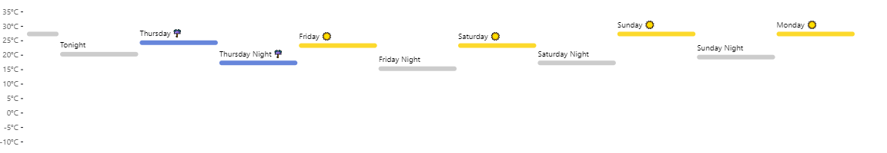

# report.md
---
title: "HW 1, CS 625, Fall 2021"
author: "Prachi Patel"
date: Sep 9, 2021
output: rmarkdown::github_document
---

```{r setup, include=FALSE}
knitr::opts_chunk$set(echo = TRUE)
```
To access my report.md (the result of Knitting your R Markdown) here is the link:
https://github.com/PrachiPatelCS/report.md.git

## Git, GitHub

1. *What is your GitHub username?*
     https://github.com/PrachiPatelCS 

2. *What is the URL of your remote GitHub repo (created through Mr. Kennedy's exercises)?*

https://github.com/PrachiPatelCS/Prachi-Patel---Mr.-Thomas-Kennedy-.git

## R

The command below will load the tidyverse package.  If you have installed R, RStudio, and the tidyverse package, it should display a list of loaded packages and their versions.
```{r}
library(tidyverse)
```

## R Markdown 

1. *Create a bulleted list with at least 3 items*

### Today's shopping list:

* Milk
* Cereal
* Fruit

2. *Write a single paragraph that demonstrates the use of italics, bold, bold italics, code, and includes a link. The paragraph does not have to make sense.*
### Paragraph

* or _ can be used to note emphasis

** or __ can be used to bold text

*Run* to markdown!

Run to _cat_ in the barn!

Host a **dinner** party!

How are __you!__

Run __*faster*__ than the wind!

Time to **_learn_** some markdown!

How will ***time*** pass today!

___Who___ is at the door!

### Link
[I'm an inline-style link](https://www.google.com)

### Code

```{r}
library(tidyverse)
```

```javascript
var s = "JavaScript syntax highlighting";
alert(s);
```
 
```python
s = "Python syntax highlighting"
print s
```


3. *Create a level 3 heading*
### Example of Level 3 Heading

## R 

#### Data Visualization Exercises

1. (Q2) *How many rows are in mpg? How many columns?*

dim(mtcars)
32 11


1. (Q4) *Make a scatterplot of hwy vs cyl.*
The code below is a way of making scattterplot of hwy vs cyl in R as I was doing this it was dificult for me to work with them because R is a fairly new tool for me and I had look at my youtube video as well as the basic step to achive this scatterplot. While I was trying to run this I did get into a lot of and I m still getting stuck since this is new for me.

```
ggplot(data = mpg) + geom_point(mapping = aes(x = displ, y = hwy))
```

#### Workflow: basics Exercises

1. (Q2) *Tweak each of the following R commands so that they run correctly (`library(tidyverse)` is correct):*

```r
library(tidyverse)
ggplot(dota = mpg) + 
  geom_point(mapping = aes(x = displ, y = hwy))
fliter(mpg, cyl = 8)
filter(diamond, carat > 3)
```
</div>

<div class="answer">


library(tidyverse)

ggplot(data = mpg) + 
  geom_point(mapping = aes(x = displ, y = hwy))

filter(mpg, cyl == 8)
filter(diamonds, carat > 3)
     
     

## Google Colab

 Link to the google colab that had to make changes to - https://colab.research.google.com/drive/1XTBPU9RnwjcWnzHXIXtDlxLj8Uxxbccu?usp=sharing

1. *What are the URLs of your Google Colab notebooks (both Python and R)?*

https://colab.research.google.com/drive/1BPsadF-9uhV7Ns__ucojvZaBkeobIHPt?usp=sharing

## Tableau

*Insert your the image of your final bar chart here*
      
      

1. *What conclusions can you draw from the chart?*

## Observable and Vega-Lite

### A Taste of Observable

1. *In the "New York City weather forecast" section, try replacing `Forecast: detailedForecast` with `Forecast: shortForecast`. Then press the blue play button  or use Shift-Return to run your change. What happens?*
     
     What I observed was that before I plessed the blue play button there was a lot of detailed about the weather information and as soon I pressed the blue button it gave me a dense version or a shorten verion of it with just he important points.

1. *Under the scatterplot of temperature vs. name, try replacing `markCircle()` with `markSquare()`. Then press the blue play button  or use Shift-Return to run your change. What happens? How about `markPoint()`?*
     
     As soon as we change `markCircle()` with `markSquare()` wee see the point that were circle on the scattered plot have now became into squares. As for when  we change it to  `markPoint()` this represents the pixel area of the mark and changes it to default whcih is a circle.

1. *Under "Pick a location, see the weather forecast", pick a location on the map.  Where was the point you picked near?*
     
     Looks like I picked a place near "Four Oaks, NC". hNow, the data is howing me the weatherStation’s forecast URL to retrieve the current forecast for Four Oaks, NC. 

1. *The last visualization on this page is a "fancy" weather chart embedded from another notebook.  Click on the 3 dots next to that chart and choose 'Download PNG'.  Insert the PNG into your report.*
     
     

### Charting with Vega-Lite

`markCircle()`

1. *Pass an option of `{ size: 200 }` to `markCircle()`.*
1. *Try `markSquare` instead of `markCircle`.*
1. *Try `markPoint({ shape: 'diamond' })`.*

`vl.x().fieldQ("Horsepower")`, ...

1. *Change `Horsepower` to `Acceleration`*
1. *Swap what fields are displayed on the x- and y-axis*

`vl.tooltip().fieldN("Name")`

1. *Change `Name` to `Origin`.*

Another example, `count()`

1. *Remove the `vl.y().fieldN("Origin")` line.*
1. *Replace `count()` with `average("Miles_per_Gallon")`.*

## References

*Every report must list the references that you consulted while completing the assignment. If you consulted a webpage, you must include the URL.*

* Insert Reference 1, https://www.example.com
* Insert Reference 2, https://www.example.com/reallyreallyreally-extra-long-URI/
